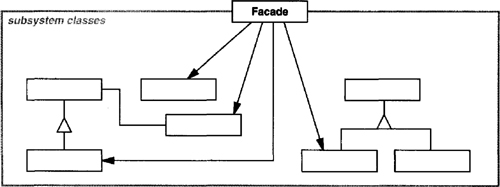

# Design Pattern Detection System
written in C++11, using ANTLR4 for source parsing.

## Desgin Patterns

### Adapter

### Proxy

- Proxy (ImageProxy)
  - maintains a reference that lets the proxy access the real subject. Proxy may refer to a Subject if the RealSubject and Subject interfaces are the same.
  - provides an interface identical to Subject’s so that a proxy can by substituted for the real subject.
  - controls access to the real subject and may be responsible for creating and deleting it.
  - other responsibilities depend on the kind of proxy:
    - remote proxies are responsible for encoding a request and its arguments and for sending the encoded request to the real subject in a different address space.
    - virtual proxies may cache additional information about the real subject so that they can postpone accessing it. For example, the ImageProxy from the Motivation caches the real image’s extent.
  - protection proxies check that the caller has the access permissions required to perform a request.

- Subject (Graphic)
  - defines the common interface for RealSubject and Proxy so that a Proxy can be used anywhere a RealSubject is expected.

- RealSubject (Image)
  - defines the real object that the proxy represents.

### Composite


- Component (Graphic)
  - declares the interface for objects in the composition.
  - implements default behavior for the interface common to all classes, as appropriate.
  - declares an interface for accessing and managing its child components.
  - (optional) defines an interface for accessing a component’s parent in the recursive structure, and implements it if that’s appropriate.

- Leaf (Rectangle, Line, Text, etc.)
  - represents leaf objects in the composition. A leaf has no children.
  - defines behavior for primitive objects in the composition.

- Composite (Picture)
  - defines behavior for components having children.
  - stores child components.
  - implements child-related operations in the Component interface.

- Client
  - manipulates objects in the composition through the Component interface.

### Bridge

- Abstraction (Window)
  - defines the abstraction’s interface.
  - maintains a reference to an object of type Implementor.

- RefmedAbstraction (IconWindow)
  - Extends the interface defined by Abstraction.

- Implementor (WindowImp)
  - defines the interface for implementation classes. This interface doesn’t have to correspond exactly to Abstraction’s interface; in fact the two interfaces can be quite different. Typically the Implementor interface provides only primitive operations, and Abstraction defines higher-level operations based on these primitives.

- ConcreteImplementor (XWindowImp, PMWindowImp)
  - implements the Implementor interface and defines its concrete implementation.

### Strategy

- Strategy (Compositor)
  - declares an interface common to all supported algorithms. Context uses this interface to call the algorithm defined by a ConcreteStrategy.

- ConcreteStrategy (SimpleCompositor, TeXCompositor, ArrayCompositor)
  - implements the algorithm using the Strategy interface.

- Context (Composition)
  - is configured with a ConcreteStrategy object.
  - maintains a reference to a Strategy object.
  - may define an interface that lets Strategy access its data.

#### Collaborations
- Strategy and Context interact to implement the chosen algorithm. A context may pass all data required by the algorithm to the strategy when the algorithm is called. Alternatively, the context can pass itself as an argument to Strategy operations. That lets the strategy call back on the context as required.

- A context forwards requests from its clients to its strategy. Clients usually create and pass a ConcreteStrategy object to the context; thereafter, clients interact with the context exclusively. There is often a family of ConcreteStrategy classes for a client to choose from.

### Builder

#### Participants
- Builder (TextConverter)
  - specifies an abstract interface for creating parts of a Product object.

- ConcreteBuilder (ASCIIConverter, TeXConverter, TextWidgetConverter)
  - constructs and assembles parts of the product by implementing the Builder interface.
  - defines and keeps track of the representation it creates.
  - provides an interface for retrieving the product (e.g., GetASCIIText, Get-Text Widget).

- Director (RTFReader)
  - constructs an object using the Builder interface.

- Product (ASCIIText, TeXText, TextWidget)
  - represents the complex object under construction. ConcreteBuilder builds the product’s internal representation and defines the process by which it’s assembled.
  - includes classes that define the constituent parts, including interfaces for assembling the parts into the final result.

#### Collaborations
- The client creates the Director object and configures it with the desired Builder object.
- Director notifies the builder whenever a part of the product should be built.
- Builder handles requests from the director and adds parts to the product.
- The client retrieves the product from the builder.
The following interaction diagram illustrates how Builder and Director cooperate with a client.


### Command

#### Participants

- Command
  - declares an interface for executing an operation.

- ConcreteCommand (PasteCommand, OpenCommand)
  - defines a binding between a Receiver object and an action.
  - implements Execute by invoking the corresponding operation(s) on Receiver.

- Client (Application)
  - creates a ConcreteCommand object and sets its receiver.

- Invoker (Menultem)
  - asks the command to carry out the request.

- Receiver (Document, Application)
  - knows how to perform the operations associated with carrying out a request. Any class may serve as a Receiver.

#### Collaborations
- The client creates a ConcreteCommand object and specifies its receiver.
- An Invoker object stores the ConcreteCommand object.
- The invoker issues a request by calling Execute on the command. When commands are undoable, ConcreteCommand stores state for undoing the command prior to invoking Execute.
- The ConcreteCommand object invokes operations on its receiver to carry out the request.

The following diagram shows the interactions between these objects. It illustrates how Command decouples the invoker from the receiver (and the request it carries out).


### Facade

#### Participants
- Facade (Compiler)
  - knows which subsystem classes are responsible for a request.
  - delegates client requests to appropriate subsystem objects.

- subsystem classes (Scanner, Parser, ProgramNode, etc.)
  - implement subsystem functionality.
  - handle work assigned by the Facade object.
  - have no knowledge of the facade; that is, they keep no references to it.

#### Collaborations
- Clients communicate with the subsystem by sending requests to Facade, which forwards them to the appropriate subsystem object(s). Although the subsystem objects perform the actual work, the facade may have to do work of its own to translate its interface to subsystem interfaces.

- Clients that use the facade don’t have to access its subsystem objects directly.

### Factory

#### Participants
- Product (Document)
  - defines the interface of objects the factory method creates.

- ConcreteProduct (MyDocument)
  - implements the Product interface.

- Creator (Application)
  - declares the factory method, which returns an object of type Product. Creator may also define a default implementation of the factory method that returns a default ConcreteProduct object.
  - may call the factory method to create a Product object.

- ConcreteCreator (MyApplication)
  - overrides the factory method to return an instance of a ConcreteProduct.

#### Collaborations
- Creator relies on its subclasses to define the factory method so that it returns an instance of the appropriate ConcreteProduct.

### Flyweight


#### Participants
- Flyweight (Glyph)
  - declares an interface through which flyweights can receive and act on extrinsic state.

- ConcreteFlyweight (Character)
  - implements the Flyweight interface and adds storage for intrinsic state, if any. A ConcreteFlyweight object must be sharable. Any state it stores must be intrinsic; that is, it must be independent of the ConcreteFlyweight object’s context.

- UnsharedConcreteFlyweight (Row, Column)
  - not all Flyweight subclasses need to be shared. The Flyweight interface enables sharing; it doesn’t enforce it. It’s common for UnsharedConcreteFlyweight objects to have ConcreteFlyweight objects as children at some level in the flyweight object structure (as the Row and Column classes have).

- FlyweightFactory
  - creates and manages flyweight objects.
  - ensures that flyweights are shared properly. When a client requests a flyweight, the FlyweightFactory object supplies an existing instance or creates one, if none exists.

- Client
  - maintains a reference to flyweight(s).
  - computes or stores the extrinsic state of flyweight(s).

#### Collaborations
- State that a flyweight needs to function must be characterized as either intrinsic or extrinsic. Intrinsic state is stored in the ConcreteFlyweight object; extrinsic state is stored or computed by Client objects. Clients pass this state to the flyweight when they invoke its operations.

- Clients should not instantiate ConcreteFlyweights directly. Clients must obtain ConcreteFlyweight objects exclusively from the FlyweightFactory object to ensure they are shared properly.


## Q&A
- Association, aggregation and dependency usually share much similarities in specific code. How to separate them by an xmi file?
    - Solution 1: Mannually add the missing relations before exporting to an xmi file. This tool presumes that all relations are present in the xmi file.
    - Solution 2: Make it the job of this tool, which results in much more complicated XMI parsing and possibly decrease of accuracy.

- if (ClassSetSPi1 ∩ ClassSetSPi2) **⊆** or **=** (ClassSetSPa ∩ ClassSetSPb) ? 
    - Suppose {**1**, 2, 3} ∩ {**4**, 2, 3} ⊆ {1, 2, 3} ∩ {1, 2, 3}. The instance set cardinality is 4 instead of 3.

- Behavioral Analysis Limitations
    - How to detect polymorphisim?
    For example:
    ```c++
    class Proxy : public Subject {
        RealSubject *subject = new RealSubject();
        void request()
        {
            // what if here inserts `subject = new some_other_subject()`
            // This could lead to catastrophic complexity.
            subject->request();
        }
    }
    ```
    The XMI file doesn't have any behavioral info of a method except method signatures and relations.
    已完成XMI文件解析，并生成对应矩阵表示，根据预定义的子模式识别出所有15种子模式，随后识别出了子模式实例中的全部设计模式结构。
    根据行为模型（方法签名等）对识别出的设计模式实例进行行为分析并过滤，完善输入输出，并进行测试。最后设计展示方案。
    
- Redefined Operation
  - Mannually alter UML or it is my job?

- One role, multiple characters?
  - Visitor pattern: ConcreteElement A, B, C, ... that would lead to recognition of CI. Plus, ObjectStructure is optional.

- Algorithm optimization
  - Full iteration through all sub-pattern instances is not always necessary. Once all the roles in specific pattern can be matched, we can just simply turn iteration to condition check. $O(n^k)$ to $O(n^{k-m}), m \ge 1$.